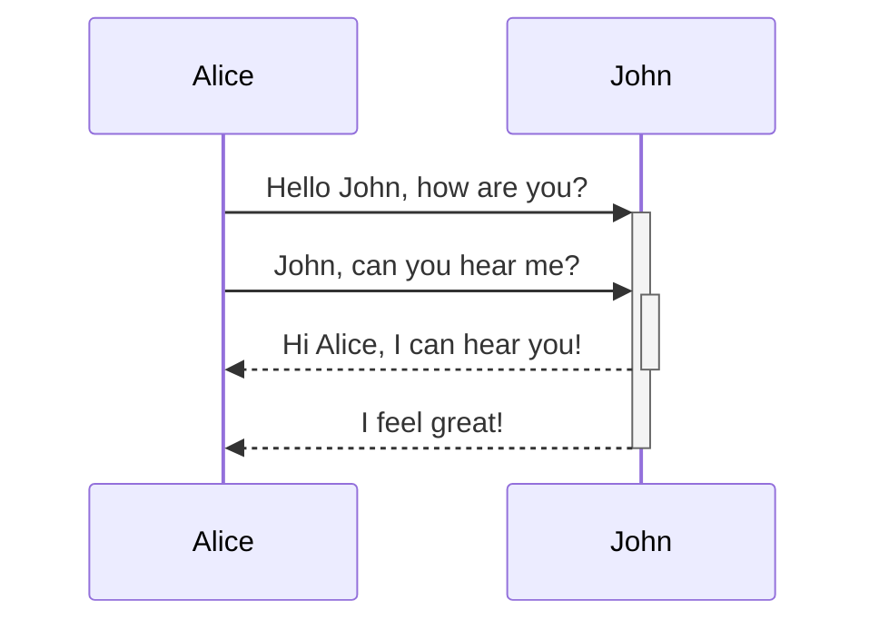

# Heading level 1
## Heading level 2
### Heading level 3
#### Heading level 4
##### Heading level 5
###### Heading level 6
Heading level 1  
===============
Heading level 2  
---------------
I just love **bold text**.

> Dorothy followed her through many of the beautiful rooms in her castle.

> Dorothy followed her through many of the beautiful rooms in her castle.
>
>> The Witch bade her clean the pots and kettles and sweep the floor and keep the fire fed with wood.

> #### The quarterly results look great!
>
> - Revenue was off the chart.
> - Profits were higher than ever.
>
>  *Everything* is going according to **plan**.

1. First item  
2. Second item  
3. Third item  
    1. Indented item  
    2. Indented item  
4. Fourth item

- First item  
- Second item  
- Third item  
    - Indented item  
    - Indented item  
- Fourth item

| One | Two | Three |
| --- | --- | ----- |
| 1   | 2   | 3     |

> [!info]
   Here's a callout block.
   It supports **Markdown**, [[Internal link|Wikilinks]], and [[Embed files|embeds]]!

#test #foo #bar

$$
\begin{vmatrix}a & b\\
c & d
\end{vmatrix}=ad-bc
$$

